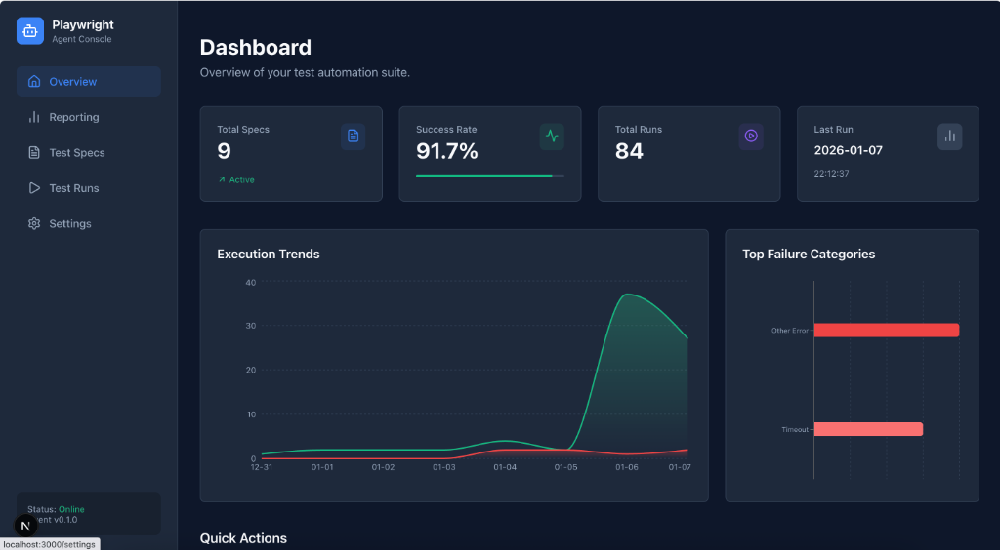

# Playwright Agent: Natural Language to Test Script Converter


Convert plain English test specifications into production-ready Playwright TypeScript tests using AI agents.

## 🚀 Overview

This automated pipeline transforms markdown-based test descriptions into executable Playwright tests. It leverages the power of LLMs and the Claude Code Agent SDK to intelligently plan, execute, and validate test scenarios.


*AI-powered test automation with a modern, intuitive dashboard for managing specs, monitoring execution trends, and analyzing test results.*

## ✨ Features
- **🤖 Natural Language to Code**: Convert simple English instructions into Playwright tests.
- **🖥️ Web Dashboard**: Manage specifications, run tests, and view results in a modern UI.
- **👁️ Interactive Mode**: Review plans and verify execution in real-time (`--interactive`).
- **📊 Rich Reporting**: Generates HTML reports and GIF replays of the execution.
- **🛡️ Self-Healing**: Automatically detects errors (timeouts, changed selectors) and fixes them on the fly.
- **🏗️ Structured Output**: Produces Page Object Models (POM) and clean, maintainable code.
- **⚡ Fast Execution**: Using intelligent caching and optimized browser contexts.

## 🚀 Usage

### ⚡️ Smart Run & Self-Healing

The agent now checks for existing generated code before starting a new run.
- **Reuse**: If valid code exists for a spec, it is run immediately (Stage 0).
- **Heal**: If the existing code fails, the agent attempts to "heal" (debug and fix) it instead of regenerating from scratch.
- **Regenerate**: Full regeneration only happens if healing fails or no code exists.

### 📊 Web Dashboard

A Next.js-based dashboard is available to manage specs and runs.

```bash
./start-ui.sh
```

Features:
- **Spec Organization**: Specs are organized into folders (`basics`, `auth`, `workflows`, etc.) for better management.
- **Run History**: detailed logs, execution plans, and generated code.
- **Live Logs**: Watch test execution in real-time.
- **Syntax Highlighting**: Beautiful code display for Specs and Tests.
Access the dashboard at [http://localhost:3000](http://localhost:3000).

### CLI Execution
```bash
playwright-agent specs/login_test.md
```

### Interactive Mode
Run with `--interactive` to review the plan before execution:
```bash
playwright-agent specs/login_test.md --interactive
```

### Output
After execution, check the `runs/` directory for:
- `report.html` - Detailed execution log
- `execution.gif` - Visual replay
- `run.video` - Full video (if enabled)
- `export.json` - Generated Playwright code

## 📦 Installation

### Prerequisites

-   Python 3.13+
-   Node.js 18+
-   **Docker & Docker Compose** (for Database)
-   Modern web browser (Chromium)
-   Claude Code (for Agent SDK)

### Setup

### ⚡ Quickstart

Get up and running in minutes with our automated setup.

```bash
# 1. Clone the repository
git clone https://github.com/your-username/playwright-agent.git
cd playwright-agent

# 2. Run Setup (installs Python, Playwright, Node.js dependencies)
make setup

# 3. Start the Dashboard
make dev
```
**That's it!** Access the dashboard at http://localhost:3000

#### Manual Setup
If you prefer manual installation:

```bash
# 1. Install Python dependencies
python3 -m venv venv
source venv/bin/activate
pip install -e .

# 2. Install PlaywrightBrowsers
npx playwright install

# 3. Install Web UI dependencies
cd web && npm install
```

### Configuration

The system loads credentials from `~/.claude/settings.json`. We recommend using **Z.ai** for cost-effective access (GLM 4.7 model).

For detailed setup instructions, see: [Z.ai Claude Code Integration Guide](https://docs.z.ai/scenario-example/develop-tools/claude).

Ensure your `~/.claude/settings.json` is configured as follows:

```json
{
  "env": {
    "ANTHROPIC_AUTH_TOKEN": "your-z-ai-token-here",
    "ANTHROPIC_BASE_URL": "https://api.z.ai/api/anthropic",
    "ANTHROPIC_DEFAULT_SONNET_MODEL": "glm-4.7"
  }
}
```

#### Alternative: OpenRouter (Free Models Available)

[OpenRouter.ai](https://openrouter.ai) provides access to **free LLM models** through an Anthropic-compatible API. This is a great option for testing and development without costs.

**Setup Steps:**
1. Sign up at [https://openrouter.ai](https://openrouter.ai) (free tier available)
2. Get your API key from [https://openrouter.ai/keys](https://openrouter.ai/keys)
3. Configure in the Settings UI or manually edit `~/.claude/settings.json`:

```json
{
  "env": {
    "ANTHROPIC_AUTH_TOKEN": "sk-or-v1-your-openrouter-key-here",
    "ANTHROPIC_BASE_URL": "https://openrouter.ai/api",
    "ANTHROPIC_DEFAULT_SONNET_MODEL": "meta-llama/llama-3.2-3b-instruct:free"
  }
}
```

**Popular Free Models:**
| Model | Provider | Context | Best For |
|-------|----------|---------|----------|
| `meta-llama/llama-3.2-3b-instruct:free` | Meta | 131k | General tasks |
| `google/gemini-2.0-flash-exp:free` | Google | 1M | Fast responses |
| `microsoft/phi-3-mini-128k-instruct:free` | Microsoft | 128k | Lightweight tasks |
| `qwen/qwen-2.5-7b-instruct:free` | Alibaba | 32k | Coding assistance |

Browse all available models: [https://openrouter.ai/models](https://openrouter.ai/models)

> **Note**: Free models have rate limits. For production use, consider paid models or Anthropic direct.


## 📖 Usage

### Convert a Test Spec

```bash
playwright-agent specs/your-test.md
```

**Output:**
-   `runs/YYYY-MM-DD_HH-MM-SS/`: artifacts (plan, run trace, logs).
-   `tests/generated/your-test.spec.ts`: The generated Playwright test.

### Run Generated Tests

```bash
# Run all
npx playwright test

# Run specific file
npx playwright test tests/generated/your-test.spec.ts
```

## 📝 Test Specifications

Test specs are written in markdown in the `specs/` directory.

### Example Spec

```markdown
# Test: Login Form

## Description
Verify user can log in with valid credentials.

## Steps
1. Navigate to https://the-internet.herokuapp.com/login
2. Enter username "tomsmith"
3. Enter password "SuperSecretPassword!"
4. Click "Login"
5. Verify success message is visible
```

### Supported Actions

-   `navigate` - Go to a URL
-   `click` - Click an element
-   `fill` - Input text
-   `select` - Select dropdown option
-   `check`/`uncheck` - Toggle checkboxes
-   `wait` - Pause for condition
-   `assert` - Verify visibility/text
-   `screenshot` - Capture current state
-   `check visual` - Verify visual layout (Visual Regression)

### 👁️ Visual Regression Testing

You can verify the visual appearance of a page by adding a "visual check" step to your spec.

```markdown
1. Navigate to https://example.com
2. Verify visual layout
```

The agent will generate a test that uses `expect(page).toHaveScreenshot()`.
- **First Run**: Captures the baseline image.
- **Subsequent Runs**: Compares the current view against the baseline.
- **Failures**: If pixels don't match, the **Run Details** page in the dashboard will show a visual comparison (Expected vs Actual vs Diff).

## 📂 Project Structure

```
playwright-agent/
├── docker-compose.yml    # Container orchestration
├── start-ui.sh           # Dashboard launcher
├── orchestrator/         # Python Backend & Logic
│   ├── api/              # FastAPI Endpoints
│   ├── workflows/        # Core pipeline logic
│   ├── reporting/        # HTML/PDF Report generation
│   └── cli.py            # CLI entry point
├── web/                  # Next.js Frontend Dashboard
│   ├── src/app/          # React Pages & Components
│   └── public/           # Static Assets
├── specs/                # Input Markdown Specifications
└── tests/generated/      # Output TypeScript Tests
```

## ❓ Troubleshooting

### Test Timeout
Complex pages may require longer timeouts. The system defaults to 30s.

### SDK Cleanup Error
If `orchestrator` processes fail to exit cleanly, check for zombie python processes. The `orchestrator_runner.py` is designed to isolate these faults.

## 📄 License

This project is licensed under the MIT License - see the [LICENSE](LICENSE) file for details.
